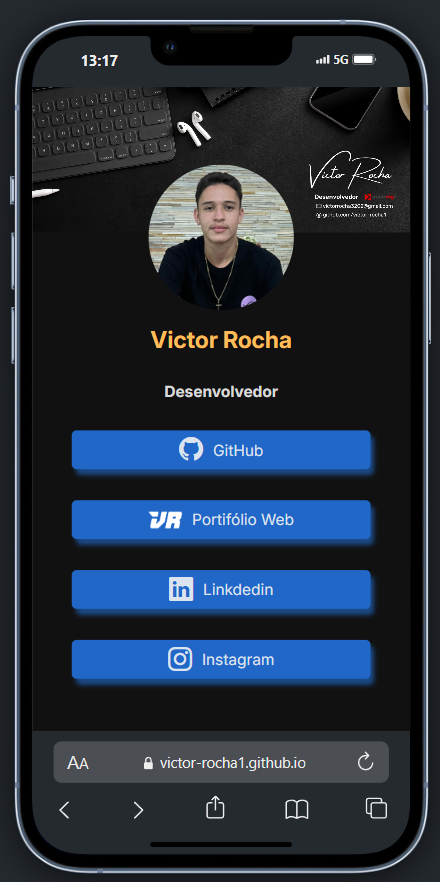

# 🌐 LinkHub - Victor Rocha

Este é o meu LinkHub pessoal, desenvolvido com **React e Bootstrap Icons**. 
Aqui você encontra todos os meus links principais — GitHub, LinkedIn, Portfólio, Instagram, entre outros — com um layout visual simples, moderno e responsivo.

## 📸 Preview


## 🔗 Acesse o projeto online

👉 [https://victor-rocha1.github.io/linkhub/](https://victor-rocha1.github.io/linkhub/)

---


## ✨ Funcionalidades

- ✅ Imagem de banner responsiva cobrindo 100% da largura
- ✅ Avatar com estilo circular centralizado
- ✅ Lista de links personalizados com ícones
- ✅ Design responsivo para dispositivos móveis
- ✅ Interface limpa e objetiva


## 🛠️ Tecnologias usadas

- [React](https://reactjs.org)
- [Vite](https://vitejs.dev/)
- HTML5 e CSS3
- Google Fonts
- Bootstrap Icons (para ícones de redes sociais)


## Estrutura de pastas (simplificada)
```bash
public/
  └── logo-victor.png
src/
  ├── App.jsx
  ├── main.jsx
  └── assets/
      ├── banner.jpeg
      ├── avatar.jpg
index.html
style.css
vite.config.js
```


## 🚀 Como rodar localmente

```bash
# Clone o repositório
git clone https://github.com/victor-rocha1/linkhub.git

# Acesse o diretório
cd linkhub

# Instale as dependências
npm install

# Inicie o projeto
npm run dev
```

## 📝 Licença
Este projeto está sob a licença MIT.

## Desenvolvido com 💙 por Victor Rocha
